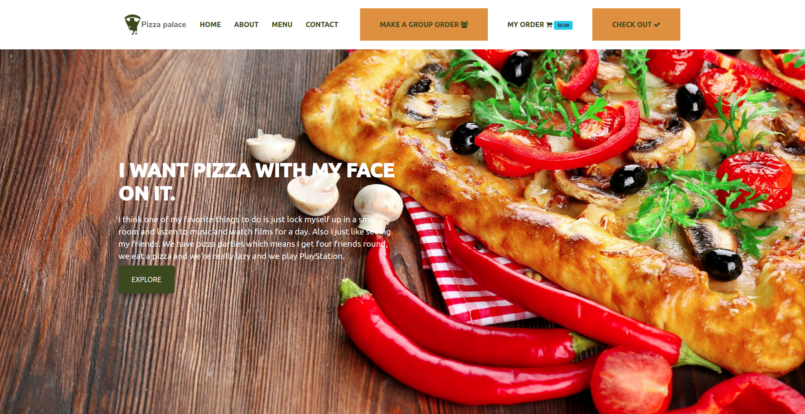

# Pizza Palace

[Live Site](https://ngatiajeffers.github.io/Pizza-Palace/)

#### A web Pizza website

#### By **Jefferson Gakuya**

## Description

Order your favorite pizza.

## Screenshot:

## Setup/Installation Requirements

1. Get to customize your favorite pizza
2. Put you favorite Crusts
3. Put your yummies toppings
4. Get to be delivered on your door

To get a local copy of the site:

`git clone https://github.com/NgatiaJeffers/Delani-Studio

_Launch_ `index.html` file.

## Tools For Creating The Website

- GitHub to host the website
- Visual Studio Code for writing codes
- A browser to display the website
- Web App
  The website to run needs only a web browserm no need of a server, if you want to run off line open with a live server in ua text editor eg. Visual Studio Code or Atom.

## Known Bugs

All the bugs fixed

## Technologies Used

- HTML5
- CSS#
- Bootstrap
- Javascript
- JQuery
- Mail Chimp for Newsletter Subscription

## Support and Contact Details

JeffDev GitHub: https://github.com/NgatiaJeffers/
JeffDev Email: jeffersongakuya@gmail.com

### License

No Licence issued.
Copyright (c) 2020 **JeffDev**

Licensed under the [JeffDev license](LICENSE).
